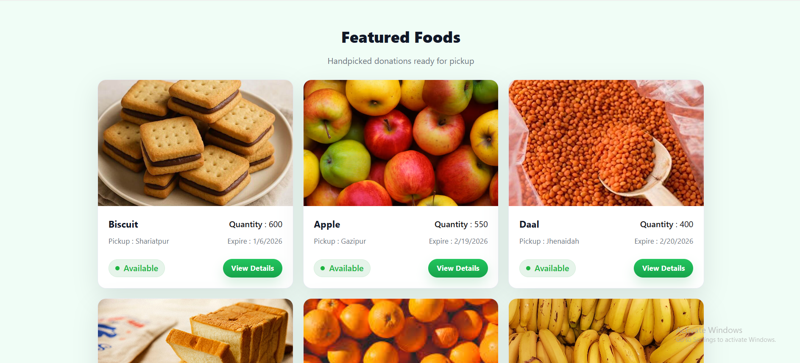
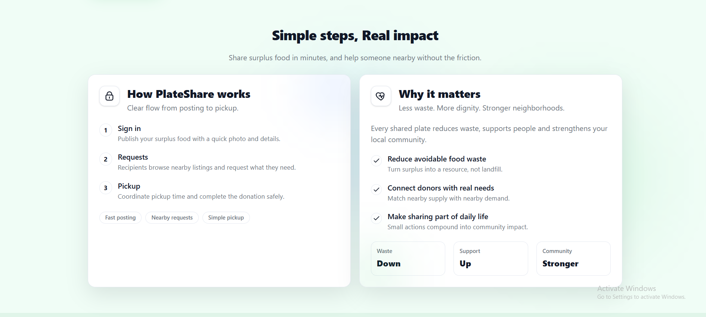
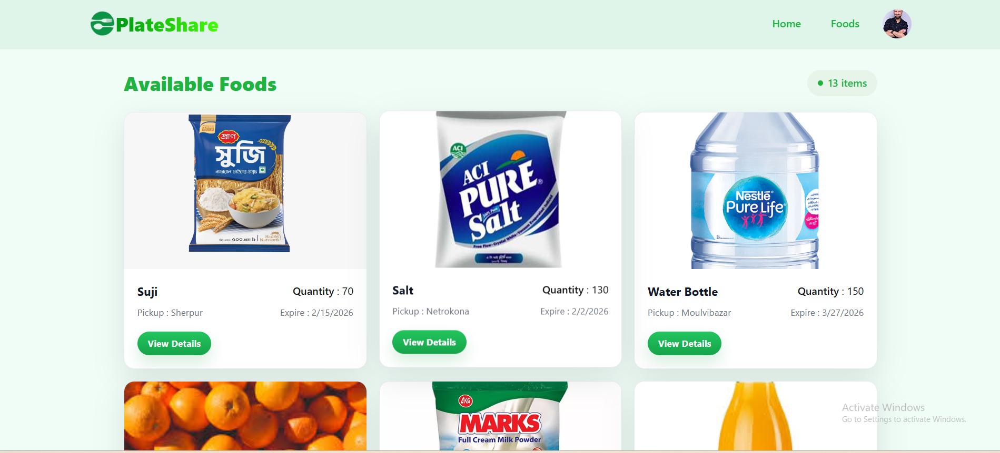
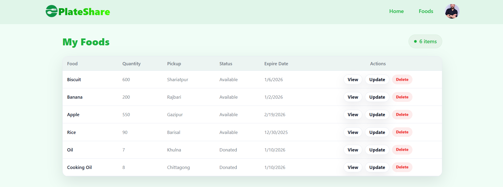
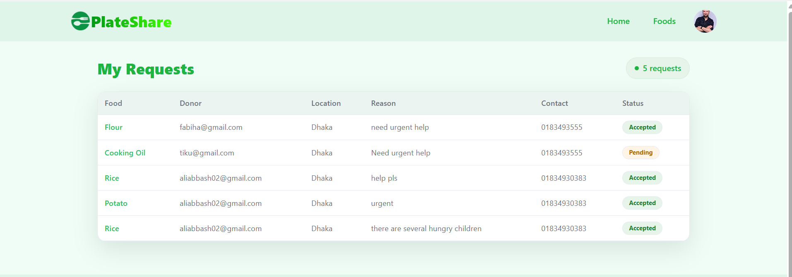
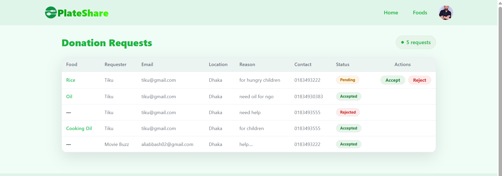

# PlateShare – Community Food Sharing Platform

PlateShare is a community-driven food sharing web application where users can donate surplus food and request available food items to reduce food waste.

🌐 Live Site: https://platesharee.vercel.app/


---


# Demo Screenshots
## Public pages






## User Private pages





---


## Features
- Users can donate food with details like quantity, location, and expiry date
- Browse available foods based on highest serving quantity
- Firebase Authentication with Email/Password and Google Login
- Private routes for Add Food, Manage My Foods, and Food Requests
- Food request system with Accept / Reject workflow

## Tech Stack
- React
- React Router DOM
- Firebase Authentication
- Tailwind CSS
- Framer Motion / AOS
- Axios
- TanStack Query (optional)

## Pages & Routes
- `/` Home
- `/available-foods`
- `/food/:id` (Private)
- `/add-food` (Private)
- `/manage-my-foods` (Private)
- `/my-food-requests` (Private)
- `/login`
- `/register`
- `*` 404 Error Page

## Authentication
- Firebase Email/Password Login
- Google Social Login
- Password validation enforced
- Protected routes persist on reload

## Setup
```bash
git clone https://github.com/Avishek02/plateshare.git
cd client
npm install
npm run dev
